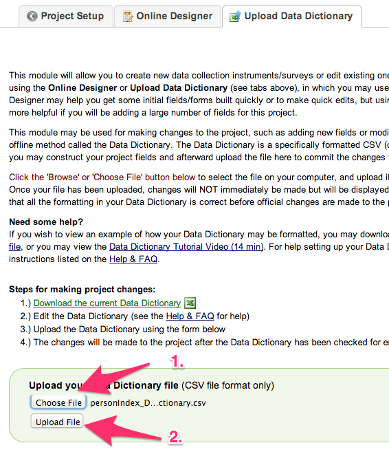
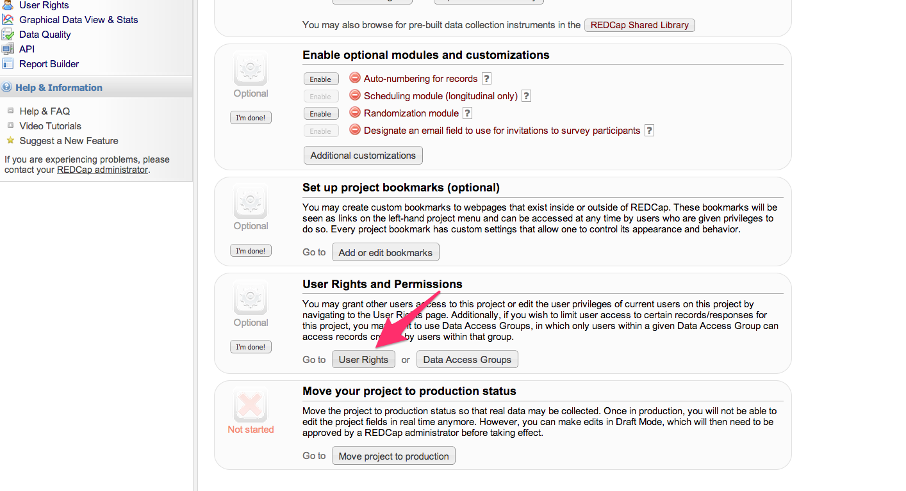
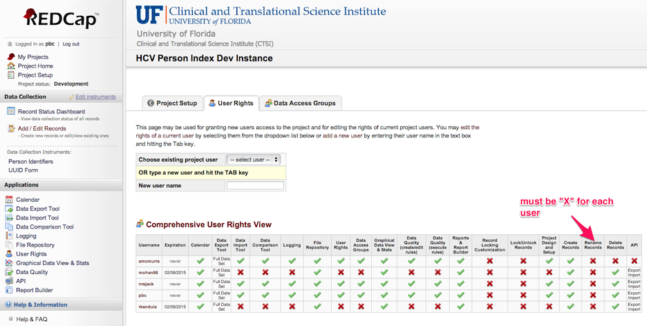
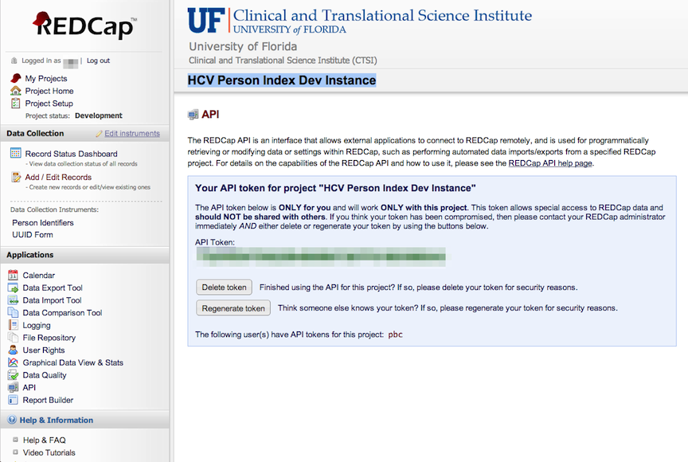

# Person Index Loading Instructions

*Note: These instructions include a section for the Health System Sites Attribute*

The person index is a REDCap project and related components that stores research subject identifiers.  This data store is designed to be populated by a human and queried by software.  

The instructions below assume you have the permissions to create a new REDCap project, load a data dictionary, edit a form field, create a user, set user permissions, and create an API Token.  Depending on how your REDCap server is configured you may or may not have the permissions to do these tasks yourself.  Consult with your local REDCap managers for assistance if you do not see these options. 

## How to Create the Person Index REDCap Project

Select the "Create New Project" tab. Enter “HCV Person Index” for the project title.

## Load this dictionary into a new REDCap project

Locate the supplied personIndex_DataDictionary.csv, select it with the "Choose File" button, and then click the “Upload File” button.

Ignore the name length errors that follow and commit the changes made by the dictionary import.

## Adjust User Rights

To adjust user rights, access the User Rights tool via the menu on the left side of the REDCap screen.

In REDCap User Rights, revoke "Rename Records" for each user.  This prevents a revision to the Subject Number after it is entered.

In REDCap User Rights, set "Data Entry Rights" to "Read Only" for the "UUID Form" to hide that form from user view.

## Create API Token

For the data in your site's Person Index to be used by programs, those programs will need access through REDCap's API interface.  You will need to create an API Token to allow those programs to authenticate and get the correct permissions on your Person Index.  

This token can be created on any account, but for automated processes a *service account* will provide a more reliable authentication.  Add a user in this REDCap project with the permissions shown here 

After you have created the new user, login as that user and request an Read-only API button on the left hand toolbar.  

